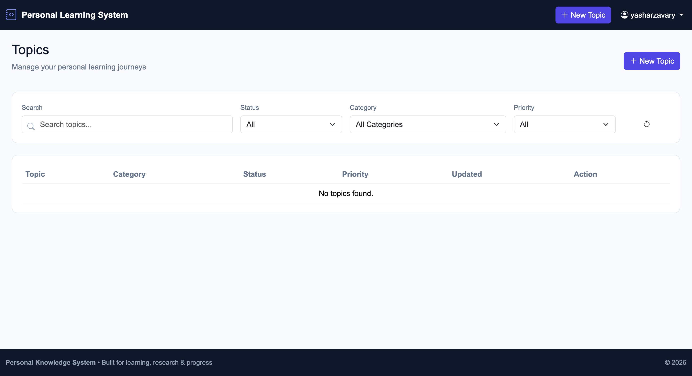

⭐ Star on GitHub — your support motivates me a lot! 🙏😊


[](https://www.linkedin.com/in/yashar-zavary-rezaie//)
[](https://t.me/yashar_360)


# Table of Contents

- [About](#-about)
- [Architecture](#architecture)
- [Features](#features)
- [Learning Lifecycle](#learning-lifecycle)
- [Project Structure](#project-structure)
- [Project Setup](#project-setup)
- [Future Improvements](#future-improvements)
- [Contributions & Feedback](#contributions--feedback)


# About

The **Personal Learning Management System** is a personal education and research management platform designed to organize technical learning journeys.

This project is not only a place for storing notes. It manages the complete lifecycle of learning a topic:

```
Idea
 ↓
Source Research
 ↓
Learning
 ↓
Experience Evaluation
 ↓
Completed
```

Each topic represents a complete learning journey where resources, notes, progress, and evaluations are connected together.

The main goal of this project is to build a personal engineering knowledge system for managing technical topics such as:

- Computer Architecture
- FPGA
- VHDL
- Programming
- Artificial Intelligence
- Mathematics
- Data Science
- Research Topics


# Architecture

The system is designed around the concept of a **Topic Lifecycle**.

Each topic contains different stages:

```
Topic

 |
 |
 +---- Topic Information
 |
 +---- Learning Timeline
 |
 +---- Source Research
 |
 +---- Learning Notes
 |
 +---- Experience Evaluation
 |
 +---- Related Topics
```

The system automatically tracks each phase and keeps the history of the learning process.


# Features


## Topic Management

Create and manage learning topics with:

- Topic title
- Description
- Category
- Priority
- Learning goal
- Origin reason
- Related files
- Learning status


Supported priorities:

- Low
- Medium
- High
- Critical


Supported statuses:

- Idea
- Source Research
- Learning
- Experience
- Completed


## Source Research Management

Collect and organize learning resources:

- Books
- Research papers
- Videos
- Courses
- Articles
- Documentation
- Personal files


Each source supports:

- Title
- URL
- File upload
- Author
- Notes
- Evaluation scores


## Learning Documentation

During the learning phase, store:

- Learning notes
- Key findings
- Important concepts
- Questions


## Experience Evaluation

After completing learning, evaluate the learning experience:

- Difficulty score
- Usefulness score
- Interest score
- Knowledge before learning
- Knowledge after learning
- Best learning method
- Final summary


## Automatic Learning Timeline

Each topic has an automatic timeline:

```
✓ Topic Created

✓ Source Research

✓ Learning

✓ Experience

✓ Completed
```

The system records:

- Phase start time
- Phase finish time
- Topic completion time


# Learning Lifecycle


## 1. Idea Phase

A new learning topic appears.

Example:

```
How does reinforcement learning work?
```

The user records:

- Why this topic appeared
- Learning goal
- Related files


---

## 2. Source Research Phase

The user collects learning resources:

```
Books
Papers
Courses
Videos
Documentation
```

After finishing this phase, the collected information becomes read-only.


---

## 3. Learning Phase

The user documents:

- Research notes
- Concepts
- Findings
- Questions

After completing this phase, learning information becomes read-only.


---

## 4. Experience Evaluation Phase

The user evaluates:

- Learning difficulty
- Knowledge improvement
- Usefulness
- Learning method

After completion, the topic can be marked as completed.


# Project Structure


```
project/

│
├── apps/
│   └── project_app/
│
├── templates/
│
├── static/
│   ├── css/
│   └── js/
│
├── media/
│
├── project_file/
│
├── manage.py
```


# Project Setup


## Clone Project

```shell
git clone https://github.com/yasharzavary/learning_topic_mangement

cd learning_topic_mangement
```


## Create Virtual Environment

```shell
python -m venv env
```


Activate:

### Linux / macOS

```shell
source env/bin/activate
```


### Windows

```shell
env\Scripts\activate
```


## Install Requirements

```shell
pip install -r requirements.txt
```


## Database Setup

```shell
python manage.py makemigrations

python manage.py migrate
```


## Create Admin User

```shell
python manage.py createsuperuser
```


## Run Project

```shell
python manage.py runserver
```


Open:

```
http://127.0.0.1:8000/
```


# Usage & Deployment

This project is designed as a **personal learning and knowledge management system**.

It is not intended as a public product or multi-user platform.  

## Local Usage

The project can be used completely locally on your own computer.

After setup, run:

```shell
python manage.py runserver
```

Then access the system through:

```
http://127.0.0.1:8000/
```

This method is suitable for:

- Personal learning management
- Offline usage
- Private research notes
- Local knowledge storage


## Online Access

For accessing the system from anywhere, the project can be deployed on a Django-compatible hosting service.

Example platforms:

- PythonAnywhere
- VPS servers
- Other Django hosting providers


Online deployment allows you to:

- Access your learning database from anywhere
- Keep your research resources available
- Manage topics across different devices


For production deployment, configure:

- Static files
- Media files
- Allowed hosts
- Production database settings
- Environment variables


The project remains a **single-user personal knowledge system** even when deployed online.


# Future Improvements

Possible future features:

- Advanced topic searching
- Topic relationship visualization
- Knowledge graph
- Vocabulary management
- Research editor
- Learning analytics dashboard
- Progress statistics
- Export learning reports


# Contributions & Feedback

Suggestions, improvements, and ideas are always welcome.

Feel free to:

- Open an issue
- Submit improvements
- Share feedback
- Contact me directly


[](https://t.me/yashar_360)

[](https://www.linkedin.com/in/yashar-zavary-rezaie//)


<div align="center">

Built with ❤️ for continuous learning, research, and personal knowledge management.

</div>